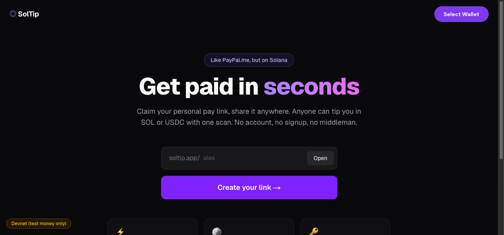
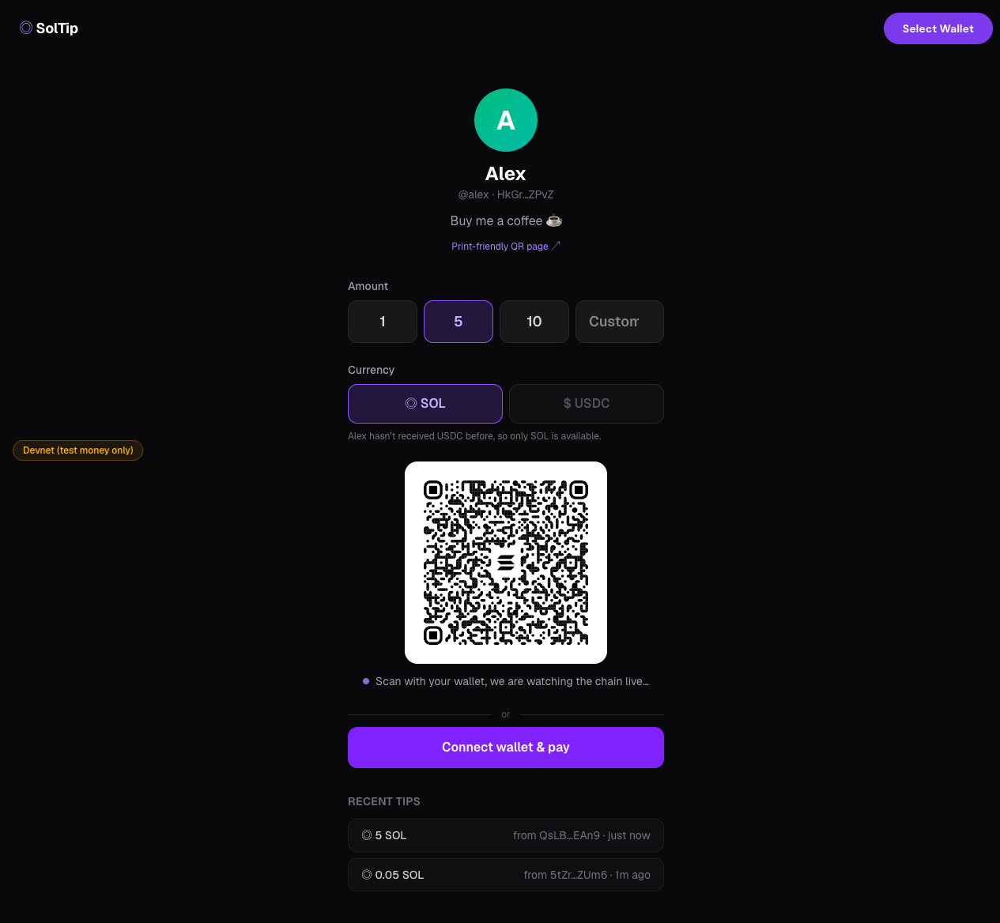
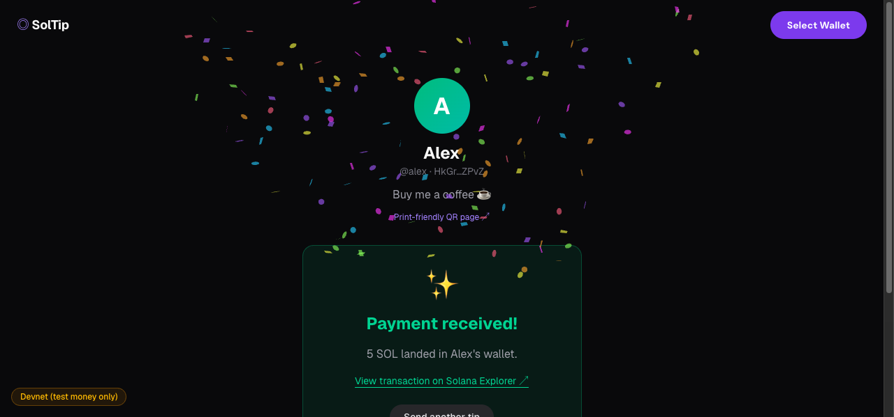

# ◎ SolTip: get paid in seconds

**Like PayPal.me, but on Solana.** Claim your personal pay link (`soltip.app/alex`) and share it anywhere. Anyone can tip you in SOL or USDC with one QR scan. Settled in about a second, fees near zero, and the page confirms the payment **live** while your tipper watches.



## How it works

SolTip is **fully non-custodial**. It never touches funds and never holds keys, because payments go straight from the payer's wallet to yours. The app is just a friendly face on top of the [Solana Pay](https://docs.solanapay.com/) standard:

1. **Claim**: connect your wallet, pick a handle, sign a message (free, no transaction). The server verifies the ed25519 signature, so only the wallet's real owner can claim a handle for it.
2. **Share**: your page renders a Solana Pay QR code for any amount in SOL or USDC. There's also a [print-friendly QR page](#routes) for the café counter.
3. **Get paid**: every payment attempt embeds a unique *reference key*. The page polls the chain for exactly that key, validates amount and recipient on-chain, and flips to a confetti confirmation the second the transfer lands.

| Pay page | Live confirmation |
| --- | --- |
|  |  |

## Features

- ⚡ **Live payment detection**: `findReference` + `validateTransfer` polling, confirmation in about a second
- 📱 **QR or click**: scan with a mobile wallet, or pay directly with a browser wallet (Phantom, Solflare, and more via Wallet Standard)
- 🪙 **SOL & USDC**: with an automatic check whether the recipient's USDC token account exists (if not, USDC is greyed out instead of failing)
- 🖨 **Printable QR page**: big, amount-less QR, the payer's wallet asks for the amount
- 📜 **On-chain tip history**: recent tips are read straight from the blockchain, no payment database
- 🔗 **Pay any address**: `/pay?to=<address>` works without registration
- 🔐 **Server-verified handle claims**: signed message with a 5-minute replay window

## Quickstart

```bash
pnpm install
cp .env.example .env.local   # defaults to devnet
pnpm dev                     # http://localhost:3000
```

Get devnet SOL at [faucet.solana.com](https://faucet.solana.com), devnet USDC at [faucet.circle.com](https://faucet.circle.com).

### Routes

| Route | Purpose |
| --- | --- |
| `/` | Landing page + handle search |
| `/create` | Claim your pay link (wallet signature, free) |
| `/[handle]` | The pay page: QR, direct pay, live confirmation, tip history |
| `/[handle]/qr` | Print-friendly full-size QR |
| `/pay?to=<address>` | Pay any raw Solana address |
| `POST /api/profiles` | Create profile (verifies signed claim message) |
| `GET /api/profiles/[handle]` | Read profile |

### End-to-end test

`scripts/e2e-devnet.mjs` exercises the whole flow against a running server, exactly like the pay page does: it claims a handle with a real signature, checks that forged signatures are rejected, pays with a Solana-Pay reference key, and validates the transfer on-chain.

```bash
pnpm start &

# Against devnet (needs faucet luck, or PAYER_SECRET=<base58> with a funded wallet):
node scripts/e2e-devnet.mjs myhandle

# Against a local validator (no faucet limits):
solana-test-validator --quiet &
RPC_URL=http://127.0.0.1:8899 node scripts/e2e-devnet.mjs myhandle
```

`scripts/pay-url.mjs` pays any `solana:` transfer-request URL. It behaves like a mobile wallet that just scanned the QR code.

## Stack

Next.js (App Router) · TypeScript · Tailwind CSS · `@solana/web3.js` · `@solana/pay` · Solana Wallet Adapter · Drizzle ORM + SQLite

The database stores **only** the handle-to-wallet mapping. Payments never touch the server; the blockchain is the payment history.

## Going to mainnet

This runs on **devnet** by default, so it's test money only. For mainnet:

1. Set `NEXT_PUBLIC_CLUSTER=mainnet-beta` and `NEXT_PUBLIC_USDC_MINT=EPjFWdd5AufqSSqeM2qN1xzybapC8G4wEGGkZwyTDt1v`
2. Use a dedicated RPC endpoint (`NEXT_PUBLIC_RPC_URL`), because public mainnet RPC is too rate-limited for payment polling
3. For serverless deploys, swap the SQLite file for a hosted option (Turso is drop-in via Drizzle)

⚠️ Mainnet means real money. Review carefully before flipping the switch.

---

Made with 💜 by [software-architecture.ai](https://software-architecture.ai)
